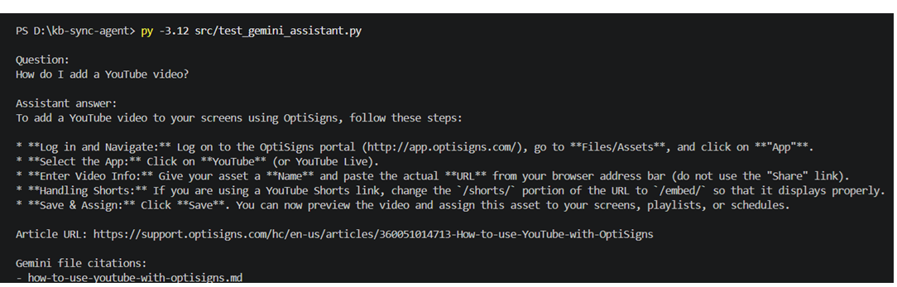

# kb-sync-agent

Mini OptiBot knowledge-base sync for OptiSigns support articles. It scrapes Zendesk articles, converts them to Markdown, uploads deltas to Gemini File Search via API, and runs as a daily job.

## Setup

```bash
python -m pip install -r requirements.txt
cp .env.sample .env
```

Set:

```env
API_KEY=
GEMINI_API_KEY=
GEMINI_FILE_SEARCH_STORE_NAME=
ARTICLE_LIMIT=30
```

## Run Locally

Sync once:

```bash
python main.py
```

Test assistant:

```bash
python src/test_gemini_assistant.py
```

Run tests:

```bash
python -m unittest discover -s tests
```

Sample question: `How do I add a YouTube video?`



## Docker

```bash
docker build -t kb-sync-agent .
docker run --env-file .env kb-sync-agent
# API_KEY is also accepted as an alias for GEMINI_API_KEY.
```

## Daily Job

GitHub Actions scheduled job: `.github/workflows/daily-sync.yml`

Schedule: `0 2 * * *` daily at 02:00 UTC.

Logs/artifacts:

```text
docs/deployment.md
docs/last-run.log
```

Chunking strategy: Gemini File Search uses whitespace chunking with 512 max tokens and 100 overlap tokens. Delta detection compares SHA-256 hashes and logs added, updated, and skipped articles.

```text
Latest local run: Articles discovered 30, Added 0, Updated 0, Skipped 30.
```
